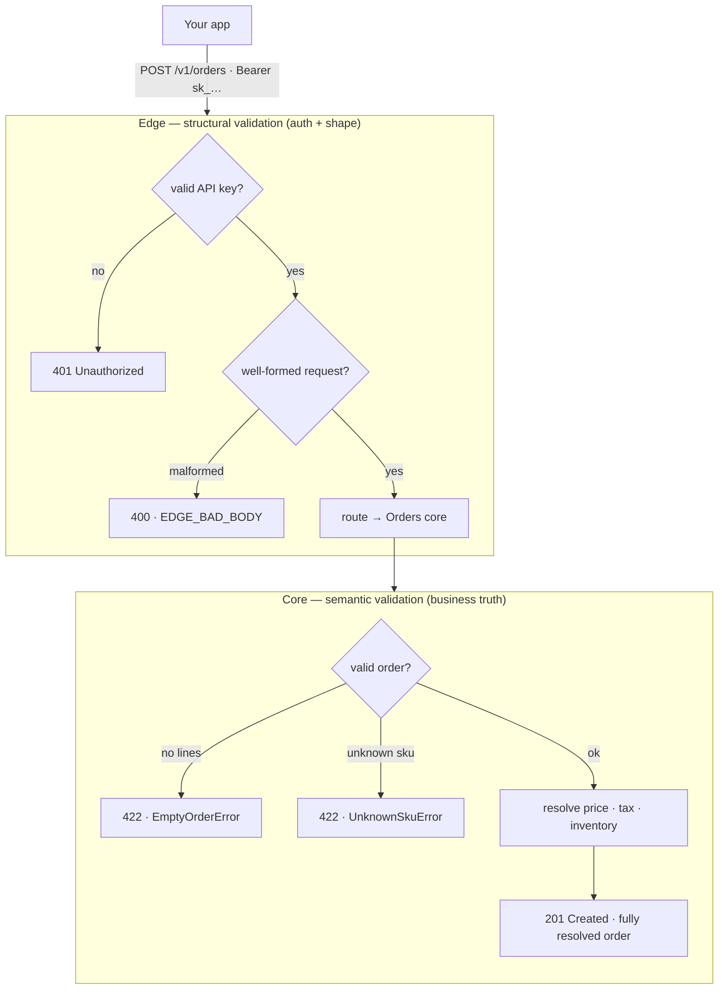

# Orders (Sales Submission) — `@experimental`

A server-priced **sales-submission** capability. The client sends a basket of
line items; the **server** derives pricing, taxes, discounts, loyalty, and
totals. Requests never carry prices, a grand total, or a currency.

```ts
const { order } = await client.orders.submit({
  lines: [{ sku: "BURGER001", qty: 2 }, { sku: "COLA001", qty: 1 }],
  customer: { phone: "+95912345678" },   // optional
  fulfillment: { type: "pickup" },       // optional
});
```

See [`openapi/orders.yaml`](../openapi/orders.yaml) for the full contract — it is
the authoritative machine contract; this page is the human reasoning model. If
the two ever differ, OpenAPI governs the wire and this page governs intent.

## How it works

`/v1/orders` crosses two boundaries. The **edge** authenticates your key and
validates request *structure*; it holds no order state and makes no pricing or
business decisions. The **core** owns the order — it validates the basket,
resolves price/tax/inventory server-side, and is the source of truth.



> **Invariant: the edge validates structure; the core validates truth.**

Clients never send prices or totals — only `{ sku, qty }`. The system returns a
fully resolved order as the source of truth.

## Contract invariants

- **Money — minor units only.** Every money field is an integer in minor units
  (e.g. `grand_total_minor: 1500`); decimals/floats are never exposed.
- **Payment — intent, not settlement.** A submission expresses purchase intent.
  In V1 it is unsettled and the response `payment_status` is `"unpaid"`. The
  payment model is extensible additively; the request carries no payment field.
- **Fulfillment.** `pickup | delivery | dine_in`. V1 serves `pickup`/`dine_in`;
  `delivery` returns `EDGE_FULFILLMENT_NOT_AVAILABLE` until it is released.
- **Errors — typed, append-only ABI.** Catch typed classes, never parse codes:
  `EmptyOrderError`, `UnknownSkuError`, `UnpricedSkuError`,
  `InsufficientStockError`, `FulfillmentNotAvailableError` (plus the shared
  auth/scope/idempotency errors).

## Relationship to `delivery`

`orders` is **additive** and independent of the legacy money-total
`delivery.create()`, which is unchanged. Pricing/inventory/accounting are owned
by the authoritative POS sales domain; the SDK never talks to it directly.

## Status

`@experimental` — the endpoint is not live until the backend is deployed. The
typed surface ships ahead of the backend so integrators can build against the
contract.
